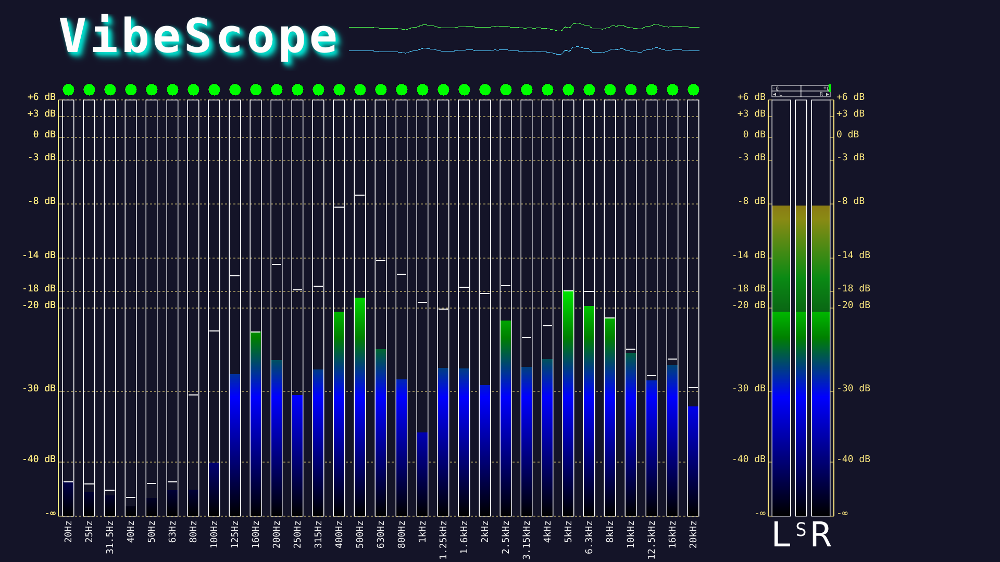

# VibeScope – Real-Time Audio Analyzer & Visualizer

A full-screen audio visualizer that brings together :

- **31-band Spectrogram** (RTA, studio analyzer style)
- **Stereo bargraphs** L / S / R (RMS & Peak)
- **VU-meters “Left / Right / Sum”**, balance indicator
- **Oscilloscopes** for each channel
- **Phase/correlation analysis**
- All in real-time!

---

<p align="center">
  
</p>

---

## Building

### Quick method (Makefile)

```bash
# Clone
git clone https://github.com/<user>/audio-analyser.git
cd audio-analyser

# Build
make  
```
                   
Feel free to fork, hack, and share!